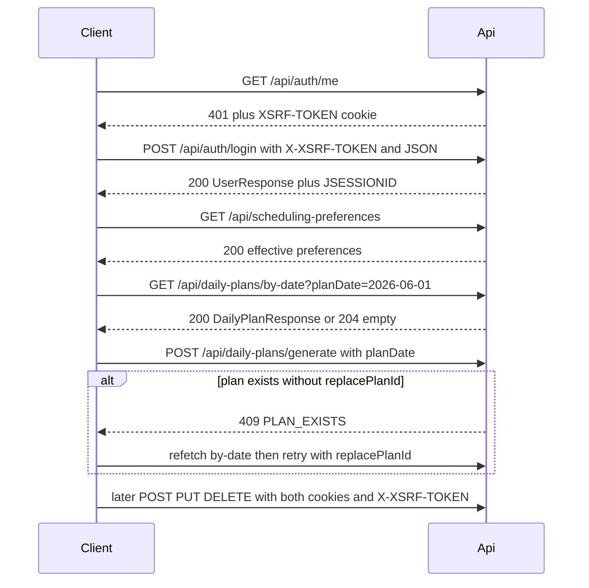

# FocusFlow AI — API Reference

Back to [README](../README.md). Machine-readable contract: [openapi.yaml](openapi.yaml) (generated from code; see README for the update command).

## Base URLs

| Environment | Base URL | Notes |
|-------------|----------|-------|
| Backend | `http://localhost:8080` | Direct Spring Boot |
| Vite dev proxy | `http://localhost:5173` | Prefer for browser and cookie-aware HTTP clients; `/api` is proxied to `:8080` |

All paths below are relative to the base URL (e.g. `POST http://localhost:5173/api/auth/login`).

## Shared calling rules

### Content type

Request bodies use `Content-Type: application/json`.

### Authentication

| Route class | Endpoints | Requirement |
|-------------|-----------|-------------|
| Public (no session) | `POST /api/auth/register`, `POST /api/auth/login` | No `JSESSIONID` required |
| Session | All other routes | Valid `JSESSIONID` session cookie |

Register and login both authenticate the user and start a session (`JSESSIONID`, HttpOnly).

### CSRF

State-changing requests (`POST`, `PUT`, `DELETE`) require:

- Cookie: `XSRF-TOKEN` (readable, not HttpOnly)
- Header: `X-XSRF-TOKEN: <same value as cookie>`

This applies to public register/login as well as authenticated mutations.

**Seed the CSRF token:** send `GET /api/auth/me` (or any request that hits the CSRF filter). When logged out, **401** is expected; the response still sets `XSRF-TOKEN`.

### Request correlation

Every response includes `X-Request-Id`. Clients may send the same header on the request; if absent or invalid, the server generates a UUID. The value appears in server logs and, for application errors that use `ApiErrorResponse`, in the JSON `requestId` field.

Unauthenticated **401** and CSRF **403** responses include the header but keep their existing minimal bodies.

### Health probes (orchestration)

| Endpoint | Auth | Notes |
|----------|------|-------|
| `GET /actuator/health/liveness` | Public | Process up; no component details |
| `GET /actuator/health/readiness` | Public | Includes PostgreSQL; no component details |
| `GET /actuator/health` | Session | Aggregate health (details hidden) |
| `GET /actuator/metrics` | Session | Micrometer metrics |

Swagger UI and `/v3/api-docs` are available only under the Spring **`dev`** profile (see README).

### Unauthenticated and CSRF failures

| Condition | Status | Body |
|-----------|--------|------|
| Protected route, no session | **401** | Minimal/empty (Spring authentication entry point; not always `ApiErrorResponse`) |
| Missing or invalid CSRF on mutation | **403** | Spring Security CSRF rejection |

### Success status codes

| Code | Usage |
|------|-------|
| **200** | OK with JSON body |
| **201** | Created with JSON body |
| **204** | Success, no body |

## Error response (`ApiErrorResponse`)

Most application errors return:

```json
{
  "timestamp": "2026-06-01T12:00:00Z",
  "status": 409,
  "error": "Conflict",
  "message": "plan already exists",
  "code": "PLAN_EXISTS",
  "path": "/api/daily-plans/generate",
  "details": {
    "title": ["must not be blank"]
  },
  "requestId": "a1b2c3d4-e5f6-7890-abcd-ef1234567890"
}
```

| Field | Type | Notes |
|-------|------|-------|
| `timestamp` | string (ISO-8601 instant) | Present on handler-generated errors |
| `status` | integer | HTTP status |
| `error` | string | Reason phrase (e.g. `Bad Request`) |
| `message` | string | Human-readable message |
| `code` | string \| null | Optional stable machine-readable code; omitted when null |
| `path` | string | Request path |
| `details` | object → string[] | Optional; field validation errors only |
| `requestId` | string | Optional; correlation id when present in MDC |

Omitted null fields are excluded from JSON (`@JsonInclude(NON_NULL)`).

### Stable error codes

Clients should branch on `code`, not `message` copy.

| Code | Typical status | When |
|------|----------------|------|
| `PLAN_EXISTS` | **409** | A plan already exists for `planDate` and `replacePlanId` was omitted |
| `PLAN_CHANGED` | **409** | `replacePlanId` is stale (another plan is now latest for that date, or no plan exists) |
| `TASK_MISSING_DURING_GENERATION` | **409** | A ranked task disappeared between the AI call and the transactional save |
| `PLAN_CANDIDATE_LIMIT` | **400** | More than 100 plannable tasks (`OPEN` + `IN_PROGRESS`) |

Invalid AI ranking returns **502** with `code` null. The server records bounded rejection reasons (`UNKNOWN_TASK`, `DUPLICATE_TASK`, `BLOCK_ORDER`, `MISSING_BLOCK_1`, `MISSING_BLOCK_2`, `MISSING_OPTIONAL`) in Micrometer only.

## Shared schemas

### `PageResponse<T>`

| Field | Type | Required |
|-------|------|----------|
| `content` | array | yes |
| `page` | integer | yes | Zero-based page index |
| `size` | integer | yes | Page size |
| `totalElements` | integer | yes | Total matching rows |
| `totalPages` | integer | yes | Total pages |

### Enums

| Name | Values |
|------|--------|
| `TaskPriority` | `LOW`, `MEDIUM`, `HIGH` |
| `TaskStatus` | `OPEN`, `IN_PROGRESS`, `DONE`, `CANCELLED` |
| `BlockKind` | `WORK`, `CADENCE_BREAK`, `FIXED_BREAK`, `COMMITMENT`, `BUFFER` |
| `UnplacedReason` | `NO_ESTIMATE`, `OUT_OF_TIME` |

### `UserResponse`

| Field | Type | Required |
|-------|------|----------|
| `id` | integer | yes |
| `email` | string | yes |
| `username` | string | yes |

### `TaskResponse`

| Field | Type | Required | Notes |
|-------|------|----------|-------|
| `id` | integer | yes | |
| `title` | string | yes | |
| `description` | string \| null | yes | |
| `priority` | `TaskPriority` | yes | |
| `status` | `TaskStatus` | yes | |
| `dueDate` | string (date) \| null | yes | `YYYY-MM-DD` |
| `estimatedMinutes` | integer \| null | yes | Null or positive |

### `TaskSnapshotResponse`

Frozen task fields captured at plan generation. Work blocks reference this snapshot, not live task rows.

| Field | Type | Required | Notes |
|-------|------|----------|-------|
| `sourceTaskId` | integer | yes | Original task id |
| `taskReferenceId` | integer \| null | yes | Live task id when still linked |
| `title` | string | yes | |
| `priority` | `TaskPriority` | yes | |
| `status` | `TaskStatus` | yes | Status at generate time |
| `dueDate` | string (date) \| null | yes | |
| `estimatedMinutes` | integer \| null | yes | |
| `mustInclude` | boolean | yes | `IN_PROGRESS`, or `OPEN` with due date on/before plan date |

### `ScheduledBlockResponse`

One minute-aligned interval on the day rail.

| Field | Type | Required | Notes |
|-------|------|----------|-------|
| `kind` | `BlockKind` | yes | |
| `startTime` | string (time) | yes | `HH:mm:ss` |
| `endTime` | string (time) | yes | |
| `sessionIndex` | integer \| null | yes | 1-based work session for this task; null for non-work blocks |
| `sessionCount` | integer \| null | yes | Total work sessions for this task; null for non-work blocks |
| `taskSnapshot` | `TaskSnapshotResponse` \| null | yes | Populated for `WORK` blocks |
| `label` | string \| null | yes | Fixed-break or commitment label when applicable |

### `UnplacedWorkResponse`

Ranked task that could not be fully scheduled.

| Field | Type | Required | Notes |
|-------|------|----------|-------|
| `reason` | `UnplacedReason` | yes | |
| `unplacedMinutes` | integer \| null | yes | Minutes that did not fit when `OUT_OF_TIME` |
| `taskSnapshot` | `TaskSnapshotResponse` | yes | |

### `DailyPlanWarning`

Derived on read when must-include snapshots have unplaced work. Not persisted as a separate column.

| Field | Type | Required |
|-------|------|----------|
| `requiredMinutes` | integer | yes |
| `freeMinutes` | integer | yes |
| `scheduledWorkMinutes` | integer | yes |
| `outOfTimeTasks` | array | yes |
| `unestimatedTasks` | array | yes |

`outOfTimeTasks[]`: `{ "sourceTaskId": number, "title": string, "unplacedMinutes": number }`

`unestimatedTasks[]`: `{ "sourceTaskId": number, "title": string }`

### `DailyPlanResponse`

Full scheduled-day detail.

| Field | Type | Required | Notes |
|-------|------|----------|-------|
| `id` | integer | yes | |
| `planDate` | string (date) | yes | `YYYY-MM-DD` |
| `createdAt` | string (instant) | yes | ISO-8601 |
| `windowStart` | string (time) | yes | Effective work window start |
| `windowEnd` | string (time) | yes | Effective work window end |
| `peakStart` | string (time) \| null | yes | Visual peak band; null when unset |
| `peakEnd` | string (time) \| null | yes | |
| `freeMinutes` | integer | yes | Minutes still free after scheduling |
| `scheduledWorkMinutes` | integer | yes | Work placed on the rail |
| `requiredMinutes` | integer | yes | Sum of ranked estimates considered |
| `requestedBufferMinutes` | integer | yes | Buffer requested from preferences |
| `realizedBufferMinutes` | integer | yes | Buffer actually reserved at end of window |
| `warning` | `DailyPlanWarning` \| null | yes | Derived shortfall; null when no must-include gap |
| `blocks` | `ScheduledBlockResponse[]` | yes | Ordered day rail |
| `unplacedWork` | `UnplacedWorkResponse[]` | yes | Companion list for unscheduled ranked tasks |

List-by-id, generate, and by-date return this shape.

### `DailyPlanSummaryResponse`

History list rows only — no blocks or snapshots.

| Field | Type | Required | Notes |
|-------|------|----------|-------|
| `id` | integer | yes | |
| `planDate` | string (date) | yes | `YYYY-MM-DD` |
| `createdAt` | string (instant) | yes | ISO-8601 |
| `scheduledWorkMinutes` | integer | yes | |
| `workSessionCount` | integer | yes | |
| `scheduledTaskCount` | integer | yes | |
| `unplacedWorkCount` | integer | yes | |
| `hasWarning` | boolean | yes | Derived must-include shortfall present |

### `SchedulingPreferencesResponse`

Effective scheduling settings for the current user.

| Field | Type | Required | Notes |
|-------|------|----------|-------|
| `workDayStart` | string (time) | yes | |
| `workDayEnd` | string (time) | yes | |
| `cadenceEnabled` | boolean | yes | |
| `targetFocusMinutes` | integer | yes | |
| `breakMinutes` | integer | yes | |
| `minSessionMinutes` | integer | yes | |
| `bufferMinutes` | integer | yes | |
| `peakStart` | string (time) \| null | yes | Optional visual band |
| `peakEnd` | string (time) \| null | yes | |
| `fixedBreaks` | array | yes | `{ label, startTime, endTime }` |
| `persisted` | boolean | yes | `false` when serving in-code defaults only |

### `SchedulingPreferencesRequest`

Write model for `PUT /api/scheduling-preferences`. Same fields as the response except `persisted` (always written on save). All times minute-aligned.

### `CommitmentResponse`

| Field | Type | Required |
|-------|------|----------|
| `id` | integer | yes |
| `title` | string | yes |
| `commitmentDate` | string (date) | yes |
| `startTime` | string (time) | yes |
| `endTime` | string (time) | yes |

### `CommitmentRequest`

| Field | Type | Required | Validation |
|-------|------|----------|------------|
| `title` | string | yes | Not blank, max 255 |
| `commitmentDate` | string (date) | yes | `YYYY-MM-DD` |
| `startTime` | string (time) | yes | Minute-aligned; before `endTime` |
| `endTime` | string (time) | yes | Minute-aligned |

---

## Auth

### `POST /api/auth/register`

Create account and start a session.

| | |
|---|---|
| **Auth** | Public |
| **CSRF** | Required |

**Request body — `RegisterRequest`**

| Field | Type | Required | Validation |
|-------|------|----------|------------|
| `email` | string | yes | Valid email, not blank |
| `username` | string | yes | 3–30 characters, not blank |
| `password` | string | yes | Min 8 characters, not blank |

**Responses**

| Status | Body |
|--------|------|
| **201** | `UserResponse` |
| **400** | `ApiErrorResponse` — validation failed (`details` per field) |
| **409** | `ApiErrorResponse` — `message`: `email already registered` or `username already taken` |

---

### `POST /api/auth/login`

Start a session.

| | |
|---|---|
| **Auth** | Public |
| **CSRF** | Required |

**Request body — `LoginRequest`**

| Field | Type | Required |
|-------|------|----------|
| `username` | string | yes, not blank |
| `password` | string | yes, not blank |

**Responses**

| Status | Body |
|--------|------|
| **200** | `UserResponse` |
| **401** | `ApiErrorResponse` — `message`: `Invalid credentials` |

---

### `POST /api/auth/logout`

End session. Configured in Spring Security (not `AuthController`).

| | |
|---|---|
| **Auth** | Session |
| **CSRF** | Required |

**Request body:** none

**Responses**

| Status | Body |
|--------|------|
| **204** | Empty; session invalidated, `JSESSIONID` deleted |
| **401** | Not authenticated |

---

### `GET /api/auth/me`

Current user.

| | |
|---|---|
| **Auth** | Session |
| **CSRF** | Not required |

**Responses**

| Status | Body |
|--------|------|
| **200** | `UserResponse` |
| **401** | Not authenticated |

---

## Tasks

All task routes require session. Mutations require CSRF.

### `POST /api/tasks`

Create task.

**Request body — `CreateTaskRequest`**

| Field | Type | Required | Notes |
|-------|------|----------|-------|
| `title` | string | yes | Not blank |
| `description` | string | no | |
| `priority` | `TaskPriority` | no | Default `MEDIUM` |
| `dueDate` | string (date) | no | `YYYY-MM-DD` |
| `estimatedMinutes` | integer | no | Null or positive |

**Responses**

| Status | Body |
|--------|------|
| **201** | `TaskResponse` (status `OPEN`) |
| **400** | Validation failed |
| **401** | Not authenticated |

---

### `GET /api/tasks`

List current user's tasks (ordered by due date ascending).

**Responses**

| Status | Body |
|--------|------|
| **200** | `TaskResponse[]` |
| **401** | Not authenticated |

---

### `GET /api/tasks/{id}`

Get one task.

**Responses**

| Status | Body |
|--------|------|
| **200** | `TaskResponse` |
| **401** | Not authenticated |
| **404** | `ApiErrorResponse` — `message`: `task not found` |

---

### `PUT /api/tasks/{id}`

Update task.

**Request body — `UpdateTaskRequest`**

| Field | Type | Required | Notes |
|-------|------|----------|-------|
| `title` | string | yes | Not blank |
| `description` | string | no | |
| `priority` | `TaskPriority` | no | Default `MEDIUM` if omitted |
| `status` | `TaskStatus` | no | Default `OPEN` if omitted |
| `dueDate` | string (date) | no | |
| `estimatedMinutes` | integer | no | Null or positive |

**Responses**

| Status | Body |
|--------|------|
| **200** | `TaskResponse` |
| **400** | Validation failed |
| **401** | Not authenticated |
| **404** | `message`: `task not found` |

---

### `DELETE /api/tasks/{id}`

Delete task.

**Responses**

| Status | Body |
|--------|------|
| **204** | Empty |
| **401** | Not authenticated |
| **404** | `message`: `task not found` |

---

## Scheduling preferences

All routes require session. `PUT` requires CSRF.

### `GET /api/scheduling-preferences`

Return the **effective** aggregate for the current user: saved row when present, otherwise in-code defaults. `persisted: false` means the user has never saved.

**Responses**

| Status | Body |
|--------|------|
| **200** | `SchedulingPreferencesResponse` |
| **401** | Not authenticated |

---

### `PUT /api/scheduling-preferences`

Replace the saved preferences aggregate (including the full fixed-break list).

**Request body — `SchedulingPreferencesRequest`**

**Responses**

| Status | Body |
|--------|------|
| **200** | `SchedulingPreferencesResponse` with `persisted: true` |
| **400** | Validation failed (work window, peak window, fixed breaks, cadence fields, minute alignment) |
| **401** | Not authenticated |

---

## Commitments

Dated unavailable windows. Not tasks. All routes require session; mutations require CSRF.

### `GET /api/commitments?from=&to=`

List commitments in an inclusive date range, ordered by date then start time.

**Query parameters**

| Name | Type | Required | Notes |
|------|------|----------|-------|
| `from` | string (date) | yes | `YYYY-MM-DD` |
| `to` | string (date) | yes | `YYYY-MM-DD`; must not be before `from` |

**Responses**

| Status | Body |
|--------|------|
| **200** | `CommitmentResponse[]` |
| **400** | Missing/invalid range |
| **401** | Not authenticated |

---

### `POST /api/commitments`

Create a commitment. Same-date overlaps are rejected.

**Request body — `CommitmentRequest`**

**Responses**

| Status | Body |
|--------|------|
| **201** | `CommitmentResponse` |
| **400** | Validation failed (title, times, overlap, minute alignment) |
| **401** | Not authenticated |

---

### `PUT /api/commitments/{id}`

Update a commitment.

**Responses**

| Status | Body |
|--------|------|
| **200** | `CommitmentResponse` |
| **400** | Validation failed |
| **401** | Not authenticated |
| **404** | `message`: `commitment not found` |

---

### `DELETE /api/commitments/{id}`

**Responses**

| Status | Body |
|--------|------|
| **204** | Empty |
| **401** | Not authenticated |
| **404** | `message`: `commitment not found` |

---

## Daily plans

All daily-plan routes require session. Mutations require CSRF.

### `POST /api/daily-plans/generate`

Generate a scheduled day from plannable tasks (`OPEN` and `IN_PROGRESS`). The AI returns a total ordering; the Java scheduler places work into the effective window, reserves buffer, and snapshots each ranked task. Regenerating a date compare-and-replaces the latest plan for that owner and date when `replacePlanId` matches.

**Request body — `GeneratePlanRequest`**

| Field | Type | Required | Notes |
|-------|------|----------|-------|
| `planDate` | string (date) | yes | `YYYY-MM-DD`; explicit calendar date (no server-default “today”) |
| `replacePlanId` | integer | no | Required when a plan already exists for `planDate`; must match the current latest plan id |

**Example**

```json
{
  "planDate": "2026-06-01",
  "replacePlanId": 42
}
```

**Responses**

| Status | Body |
|--------|------|
| **201** | `DailyPlanResponse` |
| **400** | `message`: `no plannable tasks available for planning`, missing/invalid `planDate`, or `code`: `PLAN_CANDIDATE_LIMIT` |
| **401** | Not authenticated |
| **409** | `code`: `PLAN_EXISTS`, `PLAN_CHANGED`, or `TASK_MISSING_DURING_GENERATION` |
| **502** | `ApiErrorResponse` — AI provider or ranking failure (`code` null; nothing saved) |

On **502** or **409** during persist, nothing is saved.

**Example success (truncated)**

```json
{
  "id": 1,
  "planDate": "2026-06-01",
  "createdAt": "2026-06-01T10:00:00Z",
  "windowStart": "09:00:00",
  "windowEnd": "18:00:00",
  "peakStart": "10:00:00",
  "peakEnd": "12:00:00",
  "freeMinutes": 45,
  "scheduledWorkMinutes": 120,
  "requiredMinutes": 180,
  "requestedBufferMinutes": 30,
  "realizedBufferMinutes": 30,
  "warning": null,
  "blocks": [
    {
      "kind": "WORK",
      "startTime": "09:00:00",
      "endTime": "10:00:00",
      "sessionIndex": 1,
      "sessionCount": 2,
      "taskSnapshot": {
        "sourceTaskId": 5,
        "taskReferenceId": 5,
        "title": "Write tests",
        "priority": "HIGH",
        "status": "IN_PROGRESS",
        "dueDate": "2026-06-01",
        "estimatedMinutes": 60,
        "mustInclude": true
      },
      "label": null
    }
  ],
  "unplacedWork": []
}
```

---

### `GET /api/daily-plans/by-date?planDate=`

Latest saved plan **detail** for a calendar date (highest `createdAt`, then highest `id` when several plans share the same date).

| | |
|---|---|
| **Auth** | Session |
| **CSRF** | Not required |

**Query parameters**

| Name | Type | Required | Notes |
|------|------|----------|-------|
| `planDate` | string (date) | yes | `YYYY-MM-DD` |

**Responses**

| Status | Body |
|--------|------|
| **200** | `DailyPlanResponse` |
| **204** | Empty — no plan for that date (ordinary empty state, not an error) |
| **400** | Missing or invalid `planDate` |
| **401** | Not authenticated |

---

### `GET /api/daily-plans`

Paged list of saved plan **summaries** for the current user (newest first by `createdAt`, then `id`).

**Query parameters**

| Name | Type | Required | Notes |
|------|------|----------|-------|
| `page` | integer | no | Default `0`, minimum `0` |
| `size` | integer | no | Default `20`, minimum `1`, maximum `100` |

**Responses**

| Status | Body |
|--------|------|
| **200** | `PageResponse<DailyPlanSummaryResponse>` |
| **401** | Not authenticated |

**Example (truncated)**

```json
{
  "content": [
    {
      "id": 1,
      "planDate": "2026-06-01",
      "createdAt": "2026-06-01T10:00:00Z",
      "scheduledWorkMinutes": 120,
      "workSessionCount": 3,
      "scheduledTaskCount": 2,
      "unplacedWorkCount": 0,
      "hasWarning": false
    }
  ],
  "page": 0,
  "size": 20,
  "totalElements": 1,
  "totalPages": 1
}
```

---

### `GET /api/daily-plans/{id}`

Get one saved plan by id.

**Responses**

| Status | Body |
|--------|------|
| **200** | `DailyPlanResponse` |
| **401** | Not authenticated |
| **404** | `message`: `daily plan not found` |

---

### `DELETE /api/daily-plans/{id}`

Owner-scoped hard delete. Removes the plan, its task snapshots, and scheduled blocks; live tasks remain.

**Responses**

| Status | Body |
|--------|------|
| **204** | Empty |
| **401** | Not authenticated |
| **404** | `message`: `daily plan not found` |

---

## Client call sequence



For curl/Postman:

1. `GET /api/auth/me` through the Vite proxy (401 seeds `XSRF-TOKEN`).
2. Read `XSRF-TOKEN` from the cookie jar.
3. Send `POST`/`PUT`/`DELETE` with `X-XSRF-TOKEN: <token>` and the same cookie jar.
4. Load a day with `GET /api/daily-plans/by-date?planDate=YYYY-MM-DD` (treat **204** as “no plan yet”).
