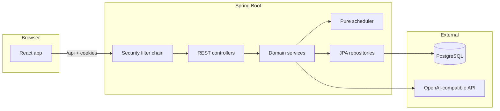
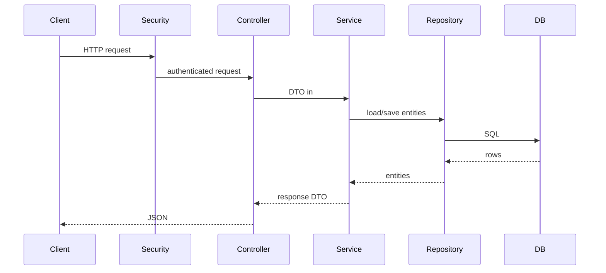
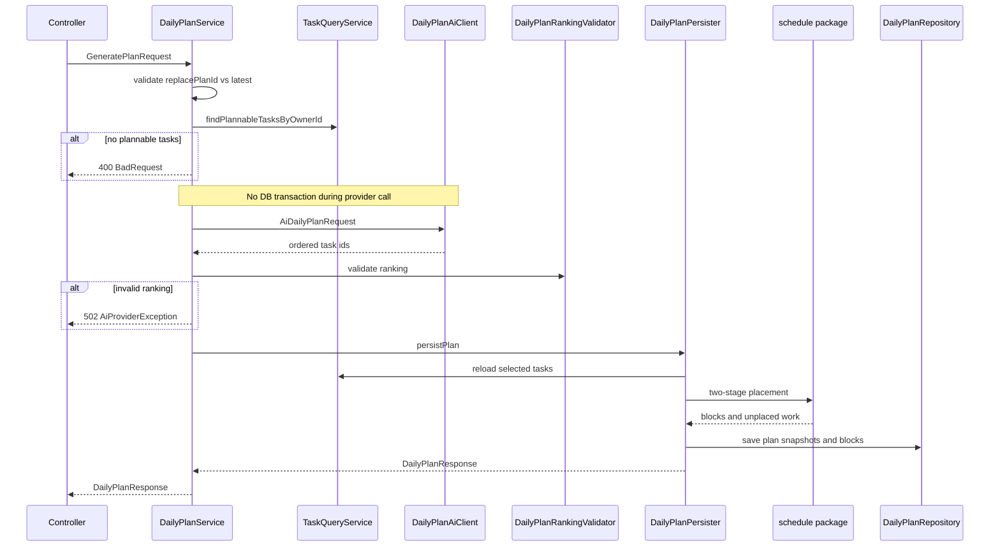
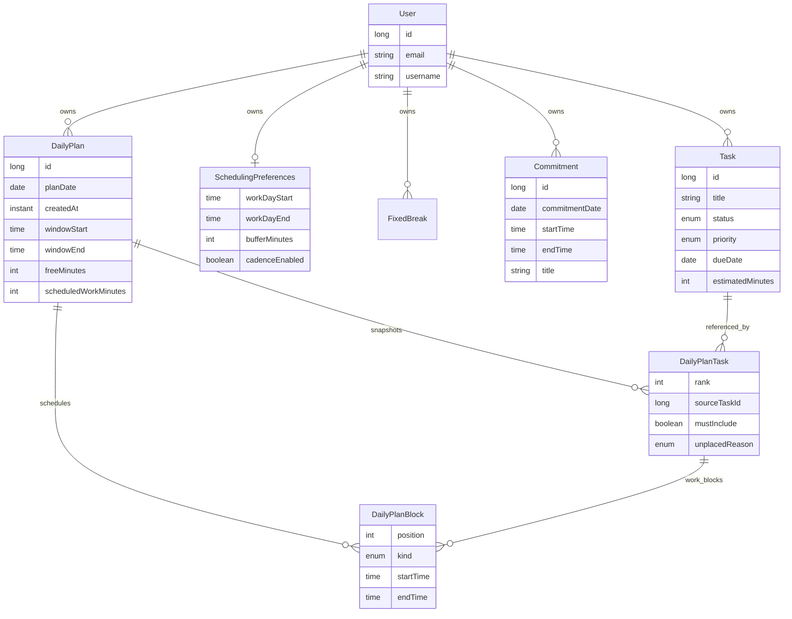

# FocusFlow AI — Architecture

Back to [README](../README.md). API contract: [api.md](api.md).

This document describes how the system is structured, what each backend component does, and how those components work together. For endpoint-level detail, see the [API reference](api.md).

## System overview

FocusFlow AI is a session-based full-stack app:

- **Backend** — Spring Boot (Java 21), JPA/Hibernate, PostgreSQL, Flyway migrations. Exposes a JSON REST API under `/api`.
- **Frontend** — React, TypeScript, Vite. Talks to the backend through a dev proxy with cookie credentials and CSRF headers.
- **External AI** — OpenAI-compatible HTTP API for daily-plan ranking (configurable via env vars).
- **Pure scheduler** — `com.focusflow.schedule` places AI-ranked tasks into minute-aligned blocks using preferences, commitments, and cadence rules.

## Request path

Every HTTP request passes through observability and security filters before reaching a controller:

1. **Request ID filter** — Validates or generates `X-Request-Id`, sets MDC for logging, echoes the header on every response (including **401**/**403**).
2. **Security filter chain** — Session cookie (`JSESSIONID`) checked for protected routes. CSRF validated on `POST`/`PUT`/`DELETE`. Public routes: register/login and detail-free liveness/readiness probes. Unauthenticated requests to protected routes return **401**.
3. **Controller** — Validates request DTOs (`@Valid`), delegates to a service, returns response DTOs. No repository access.
4. **Service** — Business logic and transactions. Resolves the current user via `CurrentUser` → `UserContext`. Owner-scoped reads use `findByOwner_IdAndId` patterns. Generation and commitment mutations take an **owner scheduling lock** (`SELECT … FOR UPDATE` on the user row).
5. **Repository** — Persistence only. Plan detail reads load task snapshots and blocks; list/history uses projection queries that never load block graphs.
6. **Exception handling** — `GlobalExceptionHandler` maps domain exceptions to `ApiErrorResponse` JSON (**400**, **404**, **409**, **502**, etc.), including optional `code` and `requestId` from MDC.

## Backend components

### `security` — authentication, CSRF, and probes

| Component | Role |
|-----------|------|
| `SecurityConfig` | Main filter chain: public register/login; session auth elsewhere; cookie CSRF; logout at `POST /api/auth/logout`. Public liveness/readiness actuator probes. Dev-profile chain permits Swagger/OpenAPI paths only. |
| `FocusFlowUserDetailsService` | Loads `User` by username for Spring Security |
| `CsrfCookieFilter` | Ensures `XSRF-TOKEN` cookie is available to clients |
| `CurrentUser` | Reads `SecurityContext`, returns `UserContext` (id, email, username) to services |
| `UserContext` | Internal identity record — not an HTTP DTO |

Services never depend on auth API DTOs; they call `currentUser.getCurrentUser()` for the owner id.

### `common/observability` — request correlation and probes

| Component | Role |
|-----------|------|
| `RequestIdFilter` | Servlet filter (highest precedence): validate/generate `X-Request-Id`, MDC, response header echo |
| `ObservabilityConfig` | Registers `RequestIdFilter` before Spring Security |
| Actuator (config) | Exposes health (with liveness/readiness groups) and metrics; aggregate health and metrics require a session |

Micrometer counters/timers in `OpenAiDailyPlanClient` and `DailyPlanRankingValidator` record bounded provider and ranking-rejection tags.

### Schema and migrations — Flyway

| Component | Role |
|-----------|------|
| `db/migration/V1__baseline.sql` | Canonical PostgreSQL schema (users, tasks, legacy plan tables) |
| `db/migration/V2__scheduling_foundations.sql` | Preferences, fixed breaks, commitments, task estimate constraint |
| `db/migration/V3__scheduled_day_plan.sql` | Destructive plan reshape: task snapshots, scheduled blocks, drops pre-1.2.0 plan rows |
| Flyway auto-config | Applies migrations at startup; `ddl-auto: none` in default profile |
| `LegacySchemaAdoptionCommand` | One-shot operator command: preflight existing DB, baseline at V1 (see README) |

Integration tests use the same Testcontainers Postgres fixture and Flyway migrations; Hibernate `validate` in the test profile checks entity/schema agreement.

### `user` — accounts and scheduling lock

| Component | Role |
|-----------|------|
| `User` | JPA entity: email, username, password hash |
| `UserRepository` | Lookup by email/username/id; `findByIdForUpdate` for pessimistic lock |
| `OwnerSchedulingLock` | `lockCurrentOwner()` inside an existing transaction — serializes generate, delete, and commitment writes per owner |

Used by `AuthService` (registration), `CurrentUser` (session resolution), and scheduling mutations.

### `auth` — registration and login API

| Component | Role |
|-----------|------|
| `AuthController` | `POST /register`, `POST /login`, `GET /me` |
| `AuthService` | BCrypt hashing, duplicate checks, `AuthenticationManager` login, maps to `UserResponse` |

Register and login both establish a server session (`JSESSIONID`).

### `task` — task CRUD and query facade

| Component | Role |
|-----------|------|
| `TaskController` | CRUD under `/api/tasks` |
| `TaskService` | Owner-scoped create/list/get/update/delete; defaults `priority` → `MEDIUM`, new tasks → `OPEN`; rejects zero/negative estimates |
| `TaskQueryService` | **Facade** for cross-feature reads — plannable tasks (`OPEN` + `IN_PROGRESS`), bulk reload by id for persist |
| `TaskRepository` | Owner-scoped queries |
| `TaskResponseMapper` | Entity → `TaskResponse` DTO |

The plan feature reads tasks only through `TaskQueryService`, not `TaskRepository` (enforced by ArchUnit).

### `preferences` — scheduling preferences

| Component | Role |
|-----------|------|
| `SchedulingPreferencesController` | `GET`/`PUT /api/scheduling-preferences` |
| `SchedulingPreferencesService` | Effective GET (saved row or in-code defaults), validating PUT with full fixed-break replacement |
| `SchedulingPreferenceDefaults` | Spec defaults when the user has never saved |
| `SchedulingPreferencesValidator` | Work window, peak band, cadence fields, fixed-break overlap, minute alignment |
| `SchedulingPreferences` / `FixedBreak` | One aggregate per owner |

Generating a plan reads effective preferences; saving preferences is explicit via PUT.

### `commitment` — dated unavailable windows

| Component | Role |
|-----------|------|
| `CommitmentController` | `GET`/`POST`/`PUT`/`DELETE /api/commitments` |
| `CommitmentService` | Range list, create, update, delete; owner lock; same-date overlap rejection |
| `CommitmentValidator` | Title, time order, minute alignment, overlap |
| `Commitment` | Dated window — not a `Task`; fed into the scheduler as unavailable time |

### `schedule` — pure placement engine

No Spring or JPA dependencies (enforced by ArchUnit). Consumed by plan generation after AI ranking.

| Component | Role |
|-----------|------|
| `FreeIntervalPlanner` | Stage 1: carve free intervals from work window minus commitments and fixed breaks |
| `WorkPlacementPlanner` | Stage 2: place ranked tasks into intervals with cadence breaks and buffer reservation |
| `SchedulePostconditionValidator` | Reject invalid placement output before persist |
| `BlockKind` | `WORK`, `CADENCE_BREAK`, `FIXED_BREAK`, `COMMITMENT`, `BUFFER` |
| `UnplacedReason` | `NO_ESTIMATE`, `OUT_OF_TIME` |

### `plan` — daily plans

| Component | Role |
|-----------|------|
| `DailyPlanController` | Paged summary list, `/by-date` (200/204), get-by-id, delete, generate under `/api/daily-plans` |
| `DailyPlanService` | Orchestrates generate, list/get/by-date/delete; compare-and-replace preconditions |
| `DailyPlanRankingValidator` | Reject-not-repair validation of AI ordering; increments Micrometer rejection counter with bounded reason tag |
| `DailyPlanPersister` | Short transactional save: reload tasks, snapshot fields, run scheduler, persist blocks |
| `DailyPlanResponseMapper` | Entity → `DailyPlanResponse`; **derives** `warning` from must-include unplaced snapshots on read |
| `DailyPlan` / `DailyPlanTask` / `DailyPlanBlock` | Aggregate: ranked task snapshots plus ordered scheduled blocks |
| `DailyPlanRepository` | Owner-scoped reads: projection queries for paged summaries; detail loads tasks and blocks |

**Summary vs detail:** History list endpoints return `DailyPlanSummaryResponse` via repository projections (`scheduledWorkMinutes`, `workSessionCount`, `scheduledTaskCount`, `unplacedWorkCount`, `hasWarning`) without loading blocks. Detail, generate, and by-date load the full graph for `DailyPlanResponse`.

**Generate flow** (the main orchestration):

Steps in code:

1. Validate compare-and-replace: existing plan without `replacePlanId` → **409** `PLAN_EXISTS`; stale id → **409** `PLAN_CHANGED`.
2. Load plannable tasks (`OPEN`, `IN_PROGRESS`). Empty → **400**; more than 100 → **400** `PLAN_CANDIDATE_LIMIT`.
3. Call `DailyPlanAiClient.generate` **outside** a database transaction.
4. `DailyPlanRankingValidator.validate` — reject invalid AI output; throw `AiProviderException` → **502**, nothing saved.
5. `DailyPlanPersister.persistPlan` (transactional, owner-locked): reload tasks, snapshot ranked rows, run scheduler, save blocks. Missing task → **409**.
6. Map to `DailyPlanResponse`; `warning` is derived on read from must-include unplaced snapshots, not stored as a separate persisted bit.

**By date:** `GET /api/daily-plans/by-date?planDate=...` returns the newest plan for that calendar date, or **204** when none exists.

**Delete** removes the plan, its task snapshots, and blocks; referenced live tasks remain.

### `ai` — provider boundary

| Component | Role |
|-----------|------|
| `DailyPlanAiClient` | Interface — mockable in tests |
| `OpenAiDailyPlanClient` | OpenAI-compatible HTTP implementation with bounded retry/timeouts and Micrometer timers/counters |
| `DailyPlanPromptBuilder` | Prompt text with task lines, status, ranking rules |
| `AiProviderException` | Provider/validation failures → **502** via `GlobalExceptionHandler` |
| `OpenAiProperties` / `OpenAiClientConfiguration` | Env-driven model, base URL, API key |

The plan service depends on the interface, not the HTTP client directly.

### `common/error` — API error contract

| Component | Role |
|-----------|------|
| `GlobalExceptionHandler` | Maps exceptions to `ApiErrorResponse` |
| `BadRequestException` | **400** (optional `code`, e.g. `PLAN_CANDIDATE_LIMIT`) |
| `NotFoundException` | **404** (missing or not owned) |
| `ConflictException` | **409** (optional `code`, e.g. `PLAN_EXISTS`, `PLAN_CHANGED`) |
| `ForbiddenOperationException` | **403** |
| `ApiErrorResponse` | Shared JSON error shape (`code`, optional `requestId`) |

## Data model

- **Owner scoping** — Tasks, plans, preferences, and commitments are always filtered by `owner_id`. Foreign ids return **404**, not **403**.
- **Task snapshots** — `DailyPlanTask` freezes title, priority, status, due date, and estimate at generate time. Work blocks point at the snapshot; live task edits afterward do not rewrite history.
- **Scheduled blocks** — Minute-aligned intervals (`WORK`, breaks, commitments, buffer) ordered by `position`.
- **Warning** — Derived on read when must-include snapshots have `unplacedReason`; not a persisted JSON snapshot column.

## Frontend structure

The React app mirrors backend feature boundaries:

| Area | Location | Role |
|------|----------|------|
| HTTP client | `frontend/src/lib/api.ts` | `fetch` with `credentials: 'include'`, CSRF header on mutations |
| Types | `frontend/src/types/api.ts` | Mirrors backend DTOs |
| Auth | `features/auth/` | Login/register forms, session hooks |
| Tasks | `features/tasks/` | List, form, actions |
| Preferences | `features/preferences/` | Settings form, GET/PUT helpers, effective-defaults copy |
| Commitments | `features/commitments/` | Dated window CRUD for the planning date |
| Plans | `features/plans/` | Generate card, `DailyPlanView`, `DayTimeline` rail, history, derived warning, delete |
| Routes | `routes/` | Dashboard (URL-backed `planDate`), plan detail/history, `/settings`, login/register |

Vite proxies `/api` to `:8080` in development so session cookies stay same-site from the browser’s perspective (`localhost:5173`).

TanStack Query hooks in each feature invalidate cache keys after mutations (e.g. plan delete refreshes list and the by-date query for the active day).

## Layering checklist (contributors)

- Controllers delegate to services only; never inject repositories.
- Services own business logic and transactions; repositories handle persistence only.
- Cross-feature reads go through facades (e.g. `TaskQueryService`), not another feature's repository.
- `com.focusflow.schedule` stays free of Spring, JPA, and HTTP DTOs.
- Security exposes `UserContext`, not auth API DTOs, to other layers.
- Architecture rules are enforced by `LayeredArchitectureTest` (ArchUnit) in `backend` tests.

## Java and Spring learning map

Open these packages in roughly this order to trace a request from HTTP to persistence and back:

- **`auth`** — `AuthController` and `AuthService` show registration, login, the Spring Security authentication manager, BCrypt password hashing, and clear duplicate-email/username conflicts.
- **`security`** — `SecurityConfig`, `CsrfCookieFilter`, `CurrentUser`, and `UserContext` teach filter-chain configuration, cookie-based CSRF, a **401** authentication entry point, session logout, and how application code receives the current user without depending on auth API DTOs.
- **`user`** — `User`, `UserRepository`, and `OwnerSchedulingLock` are the account entity, repository, and pessimistic lock used to serialize scheduling mutations per owner.
- **`task`** — `TaskController`, `TaskService`, `TaskQueryService`, and `TaskRepository` teach owner-scoped CRUD, transactions, mapping, and a small query facade. `TaskQueryService` lets the plan feature read tasks without coupling directly to another feature's repository.
- **`preferences`** — `SchedulingPreferencesController`, `SchedulingPreferencesService`, and `SchedulingPreferenceDefaults` show effective reads versus explicit saves, validation, and full aggregate replacement for fixed breaks.
- **`commitment`** — `CommitmentController` and `CommitmentService` show dated unavailable windows, overlap rejection, and owner locking alongside plan generation.
- **`schedule`** — `FreeIntervalPlanner`, `WorkPlacementPlanner`, and `SchedulePostconditionValidator` are pure Java: no Spring beans, easy to unit test, and invoked from `DailyPlanPersister` after AI ranking.
- **`plan`** — `DailyPlanController`, `DailyPlanService`, `DailyPlanTask`, `DailyPlanBlock`, and `DailyPlanRepository` show orchestration, snapshot persistence, scheduled blocks, owner-scoped reads, and compare-and-replace generation. `DailyPlanResponseMapper` derives warnings on read.
- **`ai`** — `DailyPlanAiClient` is the mockable provider boundary; `OpenAiDailyPlanClient` is the OpenAI-compatible implementation. Follow `DailyPlanPromptBuilder` to see structured prompt construction and `AiProviderException` to see provider failures become **502** responses.
- **`common/error`** — `GlobalExceptionHandler` and the exception types define the API error contract: validation or domain preconditions **400**, unauthenticated **401**, missing owner-scoped data **404**, coded conflicts **409**, and AI-provider failures **502**.
- **Repositories and JPA fetching** — Compare owner-id repository methods. `DailyPlanRepository` uses projections for history and loads task/block graphs for detail while `open-in-view` is disabled.
- **DTOs and validation** — Request/response records under each feature's `dto` package separate the HTTP contract from JPA entities.
- **Tests** — Mockito service tests isolate business behavior; `@WebMvcTest` controller tests exercise JSON, validation, and security boundaries; `PostgresIntegrationTest` uses Testcontainers for real PostgreSQL behavior; `LayeredArchitectureTest` uses ArchUnit to enforce dependency rules.

The frontend is the practical counterpart: Vite proxies `/api`, `frontend/src/lib/api.ts` uses `credentials: 'include'`, and it reads the CSRF cookie to attach the matching header for mutating requests. `DayTimeline.tsx` renders the scheduled block rail; the dashboard loads plans via `/by-date` with a URL-backed planning date.
